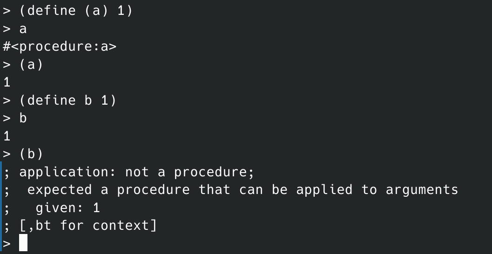

# lecture 1a

- [lecture 1a](#lecture-1a)
  - [Part 1：本课大纲](#part-1本课大纲)
  - [Part 2：lisp](#part-2lisp)

## Part 1：本课大纲

- 黑盒抽象
  - 基本对象
  - 组合的方法
  - 抽象的方法
  - 解决问题的模式
- 约定接口
  - 通用操作
  - 大型架构
  - 面向对象编程
  - 流操作
- 元语言抽象

## Part 2：lisp

一种通用的框架，组织语言的框架。

当遇见一门新语言：

- 这门语言的基本元素（primitive elements）是什么？
- 组合的方法（means of combination）是什么？
- 抽象的方法（means of abstraction）是什么？如何把解决方案封装成一个个盒子，从而我们可以将他们当作基本元素使用？

构建组合式是组合的基本需求。

在程序设计中处理的基本要素：数据，和处理数据的方式：过程。两者并不严格区分（高阶函数）。

lisp 语法基本介绍：

- 基本元素：内置符号，内置数据（阿拉伯数字）
- 组合方式：组合式，cond，if
- 抽象方法：define，block define

牛顿迭代法的 lisp 写法，用以阐释递归定义和块定义。

答疑：

- Ques: Difference between `(define a (* 5 5))` and `(define (b) (* 5 5))`?

- Ans: a is a primitive element, but b is a compound procedure.

